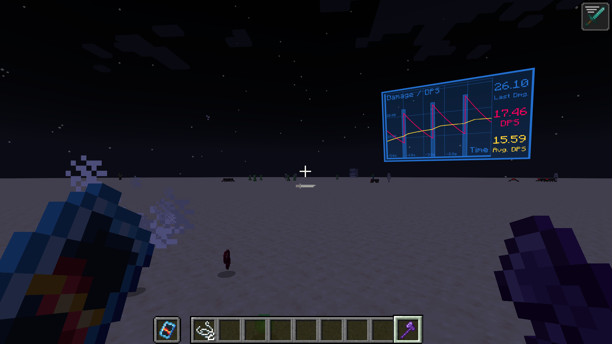
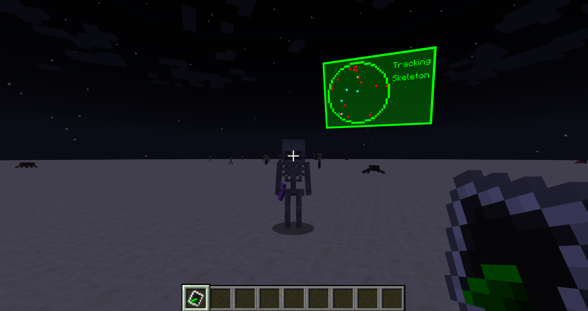
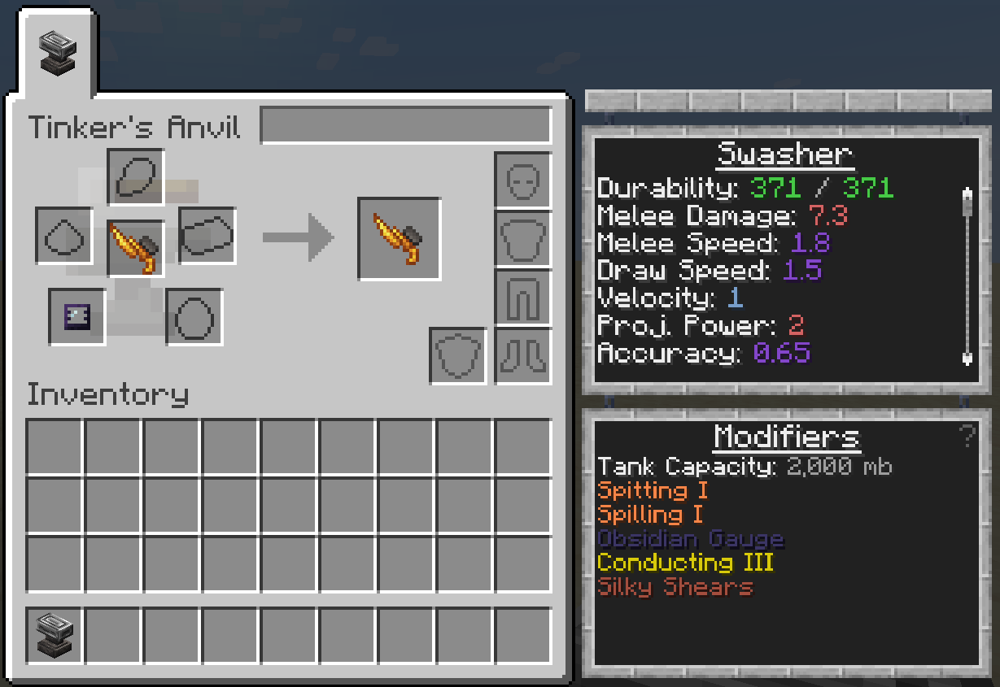
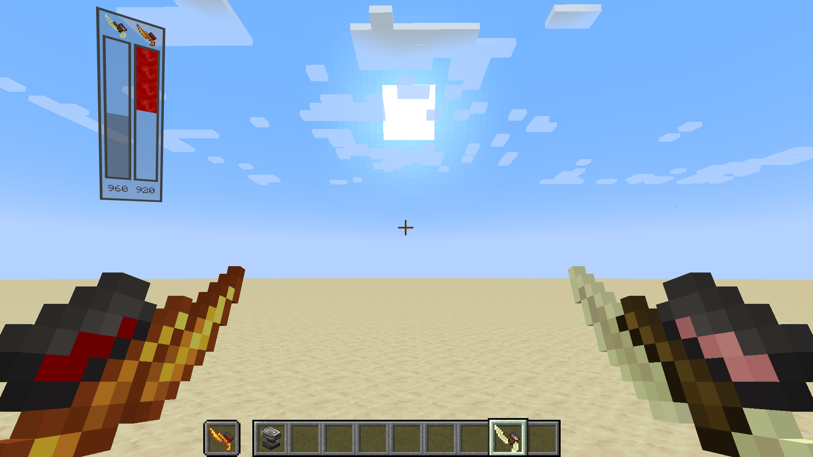
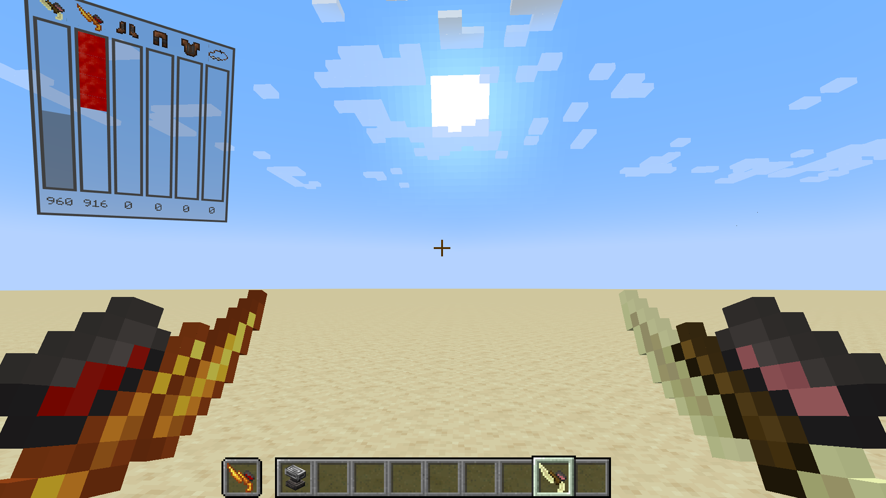
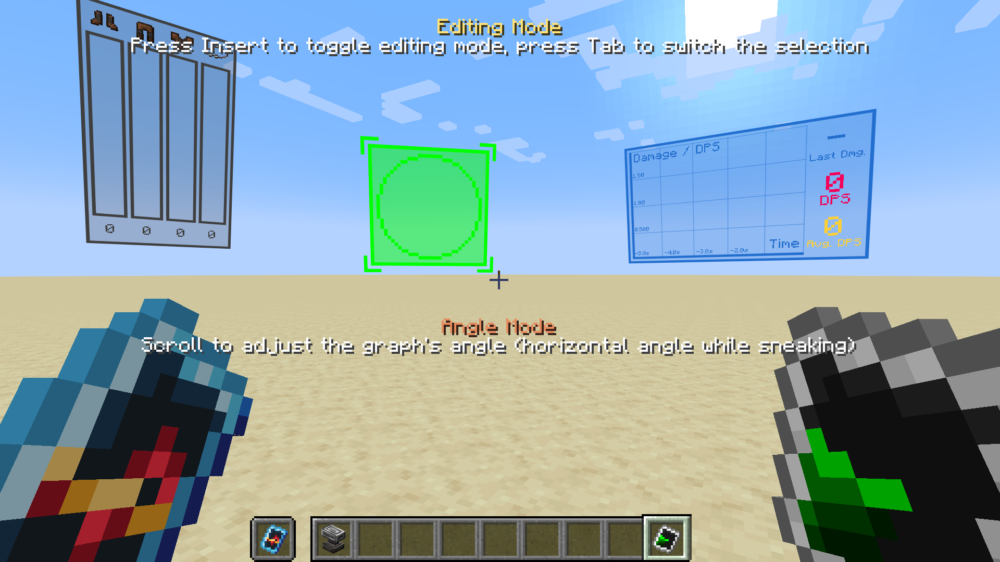
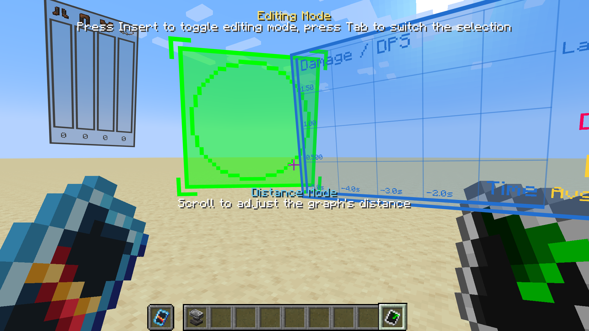

# Tinkers' Analyzer

Tinkers' Analyzer is a mod on Minecraft 1.20.1 and Forge.
This mod added some **analyzer items** to display extra info about your tool or something else.

## Requirements

- **Minecraft:** = 1.20.1
- **Forge:** &ge; 47
- **Mantle:** &ge; 1.11.97
- **Tinkers' Construct:** &ge; 3.11.2.166

## Mod Contents

### Analyzers

There are some various Analyzer items added by the mod.

#### DPS Analyzer

The DPS Analyzer is an analyzer item that displays your **recent damage, current DPS and recent average DPS**.

#### Entity Radar

The Entity Radar detects nearby entities.

You can **specify an entity type** to track by **interact with an entity**.

> This is ugly and I know that 😭

> **💡 Note:**
>
> DPS Analyzer and Entity Radar can be applied to tools as **modifiers**.

#### Copper Gauge / Obsidian Gauge

Now Gauges can be **applied to a tool with tank** as a modifier.

Copper Gauges can display the **amount of the fluid** in your tool.
Obsidian Gauges can also display the **fluid type**.

> Mainhand: End Stone Swasher with **Copper Gauge** modifier.  
> Offhand: Blazing Bone Swasher with **Obsidian Gauge** modifier.
>
> (I also made fluids that are lighter that air upside down! 🤪)

Tank display of Multiple tools with Gauge modifiers **merges** together:

#### Editing Mode

Press `Insert` to enable the layout editing mode.

---

Currently the mod is still in development. 🐧

# License

The mod is open-source and license under **MIT License**.
